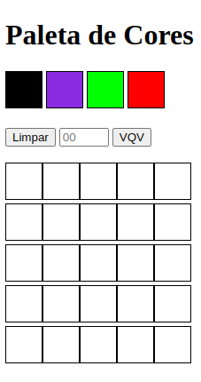

# Boas vindas ao repositório do projeto Pixels Art!

Projeto desenvolvido durante o módulo de fundamentos - Curso de Desenvolvimento WEB - Trybe.

## Objetivo

Implementar uma página web na qual contenha uma paleta de cores funcional que poderá ser utilizada para criar desenhos em pixels.

## Habilidades

- Manipular o DOM;

- Manipular o Javascript.

## Desenvolvimento

Implementar uma paleta de cores usando `javascript`, `css` e `html`.

  

    <strong>Requisitos obrigatórios:</strong>
  
 
  
- Adicione a página o título "Paleta de Cores".
- Adicione a página uma paleta de quatro cores distintas.
- Adicione na página a cor preta ela deve ser a primeira na paleta de cores.
- Adicione a página um quadro de pixels, com 25 pixels.
- Faça com que cada elemento do quadro de pixels possua 40 pixels de largura, 40 pixels de altura e seja delimitado por uma borda preta de 1 pixel.
- Definia a cor preta como cor inicial. Ao carregar a página a cor preta já deve estar selecionada para pintar os pixels.
- Selecione uma das cores da paleta, ao clicar, a cor selecionada é a que será utilizada para preencher os pixels no quadro.
- Clicar em um pixel dentro do quadro após selecionar uma cor na paleta, faz com que o pixel seja preenchido com a cor selecionada.
- Crie um botão que, ao ser clicado, limpa o quadro preenchendo a cor de todos seus pixels com branco.

  

    <strong>Requisitos bônus:</strong>
  
 

- Faça o quadro de pixels ter seu tamanho definido pelo usuário.
- Limite o tamanho do mínimo e máximo do board.
- Faça com que as cores da paleta sejam geradas aleatoriamente ao carregar a página.

## Resultado Final

Desempenho: 100% nos requisitos obrigatórios e 92% nos requisitos totais.

  

  

